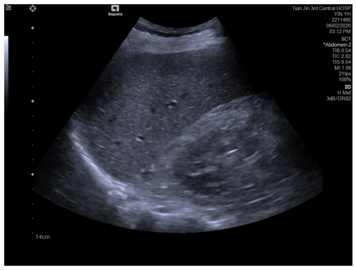

现有数据情况

第一批数据共30例病人（1-31，其中9缺失）。包含段CEUS的dicom文件119个，共46837帧。以.dcm的形式储存。除了CEUS数据，部分文件还有病人的其他信息。

我们注意到，id为1-6的文件夹数据结构较为清楚，包括BG/N1等子文件夹，结构如下：

Liver
└── 1 / DICOM
    ├── BG
    │   ├── 1 Hepatorenal Section
    │   ├── 2 Right intercostal section
    │   ├── 3 Right intercostal section (display RPV)
    │   ├── 4 Longitudinal section of Left Liver (display AO)
    │   ├── 5 Section display Ascending left portal vein (Section display ALPV)
    └── N1
         ├── 1 Maximum section of tumor
         ├── 2 Measure of Maximum section
         ├── 3 CDFI of tumor
         ├── 4 Dynamic image of tumor
         └── 5 CEUS

BG   

1 肝脏和肾脏区域的横截面影像  

2 右肋间切片  

3 右肋间切片,“RPV”（右门静脉）的解剖结构，可能用于研究门静脉血流或相关病变。  

4 左肝纵切面,AO是腹主动脉，abdominal aorta，用于评估肝脏左叶与附近大血管的关系。  

5 上升左门静脉（Ascending Left Portal Vein）的影像，显示其解剖位置和流向，用于评估门静脉分支结构和血流。  

N1  

1 包含肿瘤最大横截面的影像。可用于评估肿瘤的大小和形态特征，通常是通过CT、MRI或超声图像显示的。本次为超声图。  

2 针对肿瘤最大横截面的测量数据或影像。用于量化分析和病程监测。  

3 彩色多普勒血流成像（Color Doppler Flow Imaging） ，用于评估肿瘤内及周围血流情况。这对于了解肿瘤的血供特性、判断其性质（良性或恶性）具有重要意义。   

4 包含肿瘤的动态影像数据。（1号文件夹是51帧）   

5 增强超声成像（Contrast-Enhanced Ultrasound）用造影剂评估肿瘤的血流灌注情况。这在区分肿瘤类型（例如原发性肿瘤和转移性肿瘤）以及监测治疗效果方面有广泛应用。

其中造影图像的例子如下图所示:

1号患者姓名： YIN YH  患者 ID: 2211495 

*BG - 1 Hepatorenal Section*

*N1 -  1 Maximum section of tumor*

*N1 -  2 Mearsure of Maximum section*

*N1 - 3 CDFI of tumor*

N1 -  *4 Dynamic image of tumor*

N1 - 5 CEUS   一号患者有4个CEUS文件

第一个文件

第二个文件3分11开始3分20结束共计81帧，N1/5 CEUS/1.3.12.2.1107.5.5.17.801461.30000020020607123039200000006.dcm

第三个文件

第四个文件

ID 2的第二个CEUS 15fps

ID4的第一个CEUS 9fps

ID5 的 第三个CEUS 15fps

可以看到，CEUS分屏为左右两部分，分别对应左侧的有造影(增强超声成像（Contrast-Enhanced Ultrasound）)和右侧的无造影超声(B-mode)

左侧 Contrast 影像：用于观察 血流灌注和微循环。  

右侧 B 模式影像：显示肝实质、血管和病灶的结构。  

其他的例子如下:

从id7开始，文件夹的结构较为不同，不存在子文件夹。

7
└── DJ20200106B0614
    ├── 1.2.840.113663.1500.1.434901873.3.17.20200106.154212.516.dcm
    ├── 1.2.840.113663.1500.1.434901873.3.19.20200106.154321.425.dcm
    ├── 1.2.840.113663.1500.1.434901873.3.20.20200106.154355.319.dcm
    ├── 1.dcm
    ├── 2.dcm
    └── 3.dcm

这可能是由于数据是两个不同的科室整理的。其中9号文件夹数据缺失。部分的截图如下:

可能由于设备，操作医生不同等原因，视频在视觉形态上与之前的几段视频有所不同。

